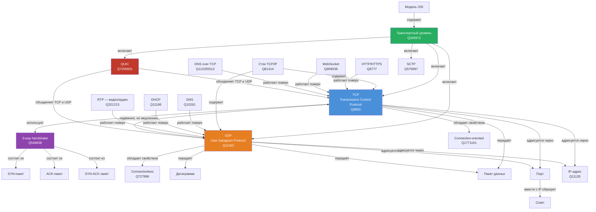

# Сетевые протоколы: TCP и UDP

## О разделе

Данный раздел посвящён протоколам транспортного уровня модели OSI — TCP и UDP.
Материалы подготовлены в рамках лабораторной работы по курсу «Искусственный интеллект».

**Автор:** oguzok2012  
**Тема:** TCP и UDP  
**Файл статьи:** `KIDBOOK/network/tcp-udp/README.md`

---

## Онтология

### Граф понятий



### Список понятий

| Понятие | WikiData ID | Описание |
|---------|-------------|----------|
| TCP | Q8803 | Протокол надёжной передачи данных |
| UDP | Q11163 | Протокол быстрой передачи без гарантий |
| Транспортный уровень | Q209372 | 4-й уровень модели OSI |
| Модель OSI | Q83418 | Семиуровневая модель сети |
| Стек TCP/IP | Q81414 | Набор сетевых протоколов |
| 3-way handshake | Q548838 | Установка соединения в TCP |
| SYN-пакет | — | Первый шаг рукопожатия |
| SYN-ACK пакет | — | Второй шаг рукопожатия |
| ACK-пакет | — | Подтверждение получения |
| Connection-oriented | Q1771161 | Передача с установкой соединения |
| Connectionless | Q727896 | Передача без установки соединения |
| Датаграмма | — | Единица данных в UDP |
| Пакет данных | — | Единица передачи в сети |
| Порт | — | Числовой идентификатор сервиса |
| Сокет | — | IP-адрес + порт |
| IP-адрес | Q11135 | Сетевой адрес устройства |
| HTTP/HTTPS | Q8777 | Протокол веб-страниц |
| WebSocket | Q859938 | Протокол двусторонней связи |
| DNS | Q10261 | Система доменных имён |
| DHCP | Q11166 | Автоматическое получение IP |
| RTP | Q321213 | Передача видео и аудио |
| QUIC | Q7265601 | Современный протокол Google |
| SCTP | Q576997 | Альтернатива TCP |

---

## Источники знаний

### WikiData — использованные SPARQL запросы

#### Запрос 1: базовая информация
```sparql
SELECT ?item ?itemLabel ?itemDescription
WHERE {
  VALUES ?item { wd:Q8803 wd:Q11163 }
  SERVICE wikibase:label {
    bd:serviceParam wikibase:language "ru,en"
  }
}
```

#### Запрос 2: все свойства TCP
```sparql
SELECT ?prop ?propLabel ?value ?valueLabel
WHERE {
  wd:Q8803 ?p ?value .
  ?prop wikibase:directClaim ?p .
  SERVICE wikibase:label {
    bd:serviceParam wikibase:language "ru,en"
  }
}
LIMIT 40
```

#### Запрос 3: протоколы транспортного уровня
```sparql
SELECT DISTINCT ?protocol ?protocolLabel ?protocolDescription
WHERE {
  ?protocol wdt:P5805 wd:Q209372 .
  SERVICE wikibase:label {
    bd:serviceParam wikibase:language "ru,en"
  }
}
LIMIT 20
```

#### Запрос 4: что работает поверх TCP и UDP
```sparql
SELECT DISTINCT ?app ?appLabel ?appDescription ?transport ?transportLabel
WHERE {
  {
    { ?app wdt:P2283 wd:Q8803 . BIND(wd:Q8803 AS ?transport) }
    UNION
    { ?app wdt:P2283 wd:Q11163 . BIND(wd:Q11163 AS ?transport) }
  }
  SERVICE wikibase:label {
    bd:serviceParam wikibase:language "ru,en"
  }
}
LIMIT 30
```

### Ключевые факты из WikiData

```json
{
  "tcp": {
    "wikidata_id": "Q8803",
    "rfc": ["793", "1323", "7323", "9293"],
    "osi_layer": "транспортный (Q209372)",
    "property": "connection-oriented (Q1771161)",
    "uses": ["IP (Q8795)", "Ethernet (Q79984)", "handshaking (Q548838)"],
    "part_of": "TCP/IP (Q81414)",
    "image": "Tcp-handshake.svg",
    "apps_on_top": ["HTTP (Q8777)", "WebSocket (Q859938)", "DNS over TCP (Q112255512)"]
  },
  "udp": {
    "wikidata_id": "Q11163",
    "rfc": ["768"],
    "date": "1980-01-01",
    "osi_layer": "транспортный (Q209372)",
    "property": "connectionless (Q727896)",
    "uses": ["IPv4 (Q11103)", "IPv6 (Q2551624)"],
    "part_of": "TCP/IP (Q81414)",
    "image": null,
    "apps_on_top": ["DHCP (Q11166)", "DHCPv6 (Q11170)", "GigE Vision (Q1128152)"]
  }
}
```

---

## Процесс генерации статьи

### Использованные инструменты
- **WikiData** — сбор структурированных фактов через SPARQL
- **DeepSeek** — генерация текста статьи

### Промпт
```

Факты из WikiData для использования в статье:

TCP (Q8803):
- RFC 793 (1981), RFC 9293 — актуальный стандарт
- Свойство: connection-oriented — перед передачей устанавливается соединение
- Использует: handshaking (3-way handshake)
- Поверх TCP работают: HTTP, WebSocket, DNS over TCP
- Картинка handshake: Tcp-handshake.svg

UDP (Q11163):
- RFC 768 (1980)
- Свойство: connectionless — соединение не устанавливается
- Поверх UDP работают: DHCP, GigE Vision (видео)
- Дата публикации: 1 января 1980

Оба протокола:
- Транспортный уровень модели OSI (Q209372)
- Часть стека TCP/IP (Q81414)
- Соседи по уровню: QUIC (современный, используется в YouTube), 
  SCTP, RTP (видео/аудио)

Объясни для десятилетнего ребёнка что такое протоколы TCP и UDP.

Требования:
- Формат GitHub Flavored Markdown
- Стиль: дружелюбный, аналогии из реальной жизни
- Структура:
  1. Заголовок # TCP и UDP
  2. Вводный абзац — зачем нужны протоколы
  3. Раздел ## TCP — с аналогией "заказное письмо"
     - объясни 3-way handshake простыми словами
     - вставь картинку: 
  4. Раздел ## UDP — с аналогией "листовки в ящик"
  5. Раздел ## Сравнение — таблица TCP vs UDP
  6. Раздел ## Где что используется — примеры HTTP, DHCP, игры, видео
  7. Раздел ## Порты — кратко что такое порт и сокет
  8. Раздел ## Интересные факты — 3 факта
- Упомяни RFC 793, RFC 768, модель OSI
- Длина: 800-1000 слов
- Оставь ссылки:
  [IP и MAC-адреса](../ip-mac/README.md)
  [DNS](../dns/README.md)
  [HTTP и HTTPS](../http-https/README.md)
  [Что происходит когда открываю сайт](../how-web-works/README.md)
"""

```